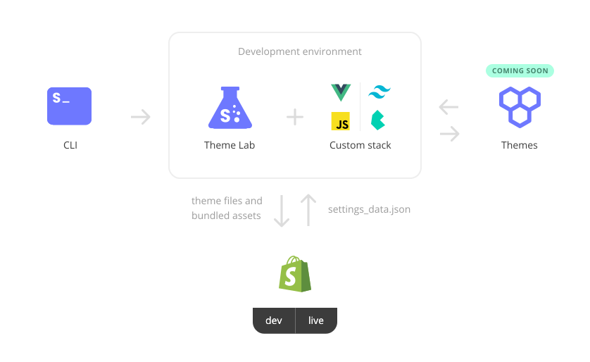

<!-- logo (start) -->
<p align="center">
  
</p>

<p align="center">
  
</p>
<!-- logo (end) -->

<!-- badges (start) -->
<p align="center">
  
  
  
</p>
<!-- badges (end) -->

<!-- title / description (start) -->
<h2 align="center">Shopify Theme Lab</h2>

Shopify Theme Lab is a customizable modular development environment for blazing-fast Shopify theme creation. By default, it's bundled with Vue.js and Tailwind CSS, but you can swap them for pretty much anything. Build a custom Shopify theme from scratch with a modern stack!

> Disclaimer: This project is not affiliated with Shopify Inc., Tailwind Labs Inc. or Vue.org

**TL;DR** Go to [Installing](#installing), then go to [Getting started](#getting-started). Now you're ready to start 🔥
<!-- title / description (end) -->

<!-- button-youtube-quick-start (start) -->
<p>
  <a href="https://youtu.be/_jFoPw_n9g4">
    
  </a>
</p>
<!-- button-youtube-quick-start (end) -->

<!-- toc (start) -->
## Table of contents

- [Ecosystem](#ecosystem)
- [Features](#features)
- [System requirements](#system-requirements)
- [Installing](#installing)
- [Getting started](#getting-started)
- [Deploying](#deploying)
  - [Teams](#teams)
  - [CI/CD](#cicd)
- [CSS preprocessors](#css-preprocessors)
  - [SASS/SCSS](#sassscss)
  - [LESS](#less)
  - [Stylus](#stylus)
- [Swapping CSS framework](#swapping-css-framework)
  - [Removing Tailwind CSS](#removing-tailwind-css)
  - [Bulma](#bulma)
- [Swapping JavaScript framework](#swapping-javascript-framework)
  - [Removing Vue](#removing-vue)
  - [React](#react)
- [Project structure](#project-structure)
- [Tasks](#tasks)
- [Development environment concepts](#development-environment-concepts)
  - [CLI](#cli)
  - [Configs](#configs)
  - [Shopify & environment initialization](#shopify--environment-initialization)
  - [Shopify + webpack](#shopify--webpack)
  - [Shopify remote auto-reloading](#shopify-remote-auto-reloading)
- [Limitations](#limitations)
- [Contributing](#contributing)
<!-- toc (end) -->

<!-- ecosystem (start) -->
## Ecosystem
<p align="center">
  
</p>

| Project | Status | Description |
| - | - | - |
| [Shopify Theme Lab](https://github.com/uicrooks/shopify-theme-lab) |  | Modular development environment for blazing-fast Shopify theming |
| [Shopify Theme Lab CLI](https://github.com/uicrooks/shopify-theme-lab-cli) |  | Command Line Interface for Shopify Theme Lab |
| [Shopify Foundation Theme](https://github.com/uicrooks/shopify-foundation-theme) |  | A modern Shopify starter theme built with Vue and Tailwind CSS
<!-- ecosystem (end) -->

<!-- features (start) -->
## Features

- Shopify
  - Self-contained, no need to install external tools
  - [Shopify Theme Kit](https://www.npmjs.com/package/@shopify/themekit) npm package included
  - Quick Shopify theme setup on a remote store with `npm run shopify:init`
  - CI/CD integration with [Shopify Theme Lab CLI](https://github.com/uicrooks/shopify-theme-lab-cli)
  - Default Shopify theme directory structure with unstyled `.liquid` files
  - A batch of `npm scripts` to run common tasks
- JavaScript
  - [Vue](https://vuejs.org)
  - [Vuex](https://vuex.vuejs.org)
  - Swap Vue with any other framework e.g. [React](https://reactjs.org)
  - [Axios](https://github.com/axios/axios)
  - Extend with [npm packages](https://www.npmjs.com) 📦
- CSS
  - [Tailwind CSS](https://tailwindcss.com)
  - Swap Tailwind CSS with any other framework e.g. [Bulma](https://bulma.io)
  - [PostCSS](https://postcss.org) with [postcss-preset-env](https://preset-env.cssdb.org/features)
  - Preprocessor support: [SASS / SCSS](https://sass-lang.com), [LESS](http://lesscss.org) and [Stylus](https://stylus-lang.com)
- Workflow
  - [Webpack](https://webpack.js.org)
  - [Babel](https://babeljs.io)
  - [ESLint](https://eslint.org)
  - [stylelint](https://stylelint.io)
  - [Browserslist](https://github.com/browserslist/browserslist)
  - [Autoprefixer](https://github.com/postcss/autoprefixer)
  - [PurgeCSS](https://tailwindcss.com/docs/optimizing-for-production#removing-unused-css) integrated in Tailwind CSS
  - Shopify remote theme auto-reloading with [shopify-reloadr](https://github.com/uicrooks/shopify-reloadr)
  - Auto-loading of Vue `components`, `mixins`, `directives` and `filters` as well as Vuex `modules` with [require.context](https://webpack.js.org/guides/dependency-management/#requirecontext)
  - Clean [config structure](.config/)
  - Easily adjustable/extendable configurations
<!-- features (end) -->

<!-- system requirements (start) -->
## System requirements

- Node.js >= `12.0.0`
- npm or yarn
<!-- system requirements (end) -->

<!-- installing (start) -->
## Installing
1. Clone this repo or simply run the following command in your terminal:

```sh
$ npx themelab create <directory-name>
```

2. Run the following command(s) with your preferred package manager:

### npm
```sh
$ npm install
```

### yarn
```sh
$ yarn import # migrate package-lock.json to yarn.lock
$ rm package-lock.json # or delete manually
$ yarn install --force
```

> If you migrated to yarn, you can replace `npm run` with `yarn` when executing upcoming commands.
<!-- installing (end) -->

<!-- getting started (start) -->
## Getting started

1. Get Shopify API access: [Instructions at Theme Kit Docs](https://shopify.github.io/themekit#get-api-access)

2. Initialize theme on Shopify store with credentials from the first step. Either for **dev** or **live** environment:

> `npm` requires the extra `--` before any arguments! When using `yarn` you can omit them.

```sh
$ npm run shopify:init -- --password [your-api-password] --store [your-store.myshopify.com] --env [dev or live] --name [theme-name]
```

3. Publish the new theme through the Shopify panel: **your-store.myshopify.com/admin/themes**

4. Start developing:
```sh
$ npm run start
$ npm run open:dev # open/preview theme in default browser
```
<!-- getting started (end) -->

<!-- deploying (start) -->
## Deploying
> first, make sure the configuration for the `live` environment is initialized.

```sh
$ npm run build # bundle js, css and other assets like images/fonts with webpack
$ npm run deploy:live # deploy shopify/ directory
```

> There is a safety mechanism in place, which won't allow you to deploy to an already published theme on the **live** store. If you want to deploy regardless use the `--allow-live` flag.

```sh
$ npm run deploy:live -- --allow-live
```

### Teams
The `shopify:init` task always creates a new theme with a unique ID for the provided store. Sometimes it can be useful to connect to an existing initialized theme (e.g. when multiple people deploy to the same live environment).

1. Run the following command to list all themes from the provided store and write down the ID for the theme in question:

```sh
$ npm run shopify:themes -- --password [your-api-password] --store [your-store.myshopify.com]
```

2. Copy and rename the Shopify sample config file:

```sh
$ cp .config/shopify/shopify.sample.yml .config/shopify/shopify.live.yml # or copy and rename manually
```

3. Adjust the contents of the newly created `shopify.live.yml` file.

### CI/CD

#### GitHub actions

1. Add the following four secrets to your Shopify Theme Lab repo in `settings` → `secrets`:

```sh
SHOPIFY_API_PASSWORD # your-api-password
SHOPIFY_STORE_URL # your-store.myshopify.com
SHOPIFY_ENV # dev or live
SHOPIFY_THEME_ID # theme-id (without quotation marks) - find the id either in shopify.[env].config.yml or with shopify:themes task
```

2. Copy and paste into a GitHub action (adjust contents if necessary):

```yml
# Shopify Theme Lab CI/CD integration for GitHub actions
name: Shopify Theme Lab CI/CD

on:
  push:
    branches: [ master ]
  pull_request:
    branches: [ master ]
  workflow_dispatch: # allows to manually run from GitHub actions panel

jobs:
  build-and-deploy:
    name: Build and Deploy
    runs-on: ubuntu-latest
    strategy:
      matrix:
        node-version: [ 14.x ]

    steps:
      - name: Checkout master branch
        uses: actions/checkout@v2

      - name: Use Node.js
        uses: actions/setup-node@v2.1.4
        with:
          node-version: ${{ matrix.node-version }}

      - name: Install dependencies and build dist files
        run: |
          npm install
          npm run build

        # first, make sure the theme is already initialized on the Shopify store in question
        #
        # Below "run" commands explained:
        # 1. creates a Shopify credential config
        # 2. downloads settings_data.json from the remote store
        # 3. deploys the shopify/ directory to the remote store
      - name: Deploy to Shopify store
        run: |
          npx themelab shopify:init -p ${{ secrets.SHOPIFY_API_PASSWORD }} -s ${{ secrets.SHOPIFY_STORE_URL }} -e ${{ secrets.SHOPIFY_ENV }} -i ${{ secrets.SHOPIFY_THEME_ID }}
          npm run settings:${{ secrets.SHOPIFY_ENV }}
          npm run deploy:${{ secrets.SHOPIFY_ENV }} -- --allow-live
```
<!-- deploying (end) -->

<!-- css preprocessors (start) -->
## CSS preprocessors
> For the most cohesive development experience, it's recommended that you use PostCSS exclusively when working with [Tailwind CSS](https://tailwindcss.com/docs/using-with-preprocessors#using-sass-less-or-stylus).

By default, only PostCSS with `postcss-preset-env` is installed. [postcss-preset-env](https://preset-env.cssdb.org/features) lets you use tomorrow’s CSS today. If you want to use a preprocessor it's recommended to use `SASS/SCSS` since it's the most compatible with a variety of CSS frameworks.

### SASS/SCSS
1. Run the following command:

#### npm
```sh
$ npm install sass sass-loader --save-dev
```

#### yarn
```sh
$ yarn add sass sass-loader --dev
```

2. Rename `src/css/main.css` to `src/css/main.scss`

3. Change `import './css/main.css'` to `import './css/main.scss'` in [src/main.js](src/main.js)

### LESS
1. Run the following command:

#### npm
```sh
$ npm install less less-loader --save-dev
```

#### yarn
```sh
$ yarn add less less-loader --dev
```

2. Rename `src/css/main.css` to `src/css/main.less`

3. Change `import './css/main.css'` to `import './css/main.less'` in [src/main.js](src/main.js)

### Stylus
1. Run the following command:

#### npm
```sh
$ npm install stylus stylus-loader --save-dev
```

#### yarn
```sh
$ yarn add stylus stylus-loader --dev
```

2. Rename `src/css/main.css` to `src/css/main.styl`

3. Change `import './css/main.css'` to `import './css/main.styl'` in [src/main.js](src/main.js)

<!-- css preprocessors (end) -->

<!-- swapping css framework (start) -->
## Swapping CSS framework

### Removing Tailwind CSS

1. Remove package:

#### npm
```sh
$ npm uninstall tailwindcss
```

#### yarn
```sh
$ yarn remove tailwindcss
```

2. Remove tailwind config:

```sh
$ rm src/tailwind.config.js # or delete manually
```

3. Inside [postcss.config.js](.config/postcss.config.js) remove `require('tailwindcss')(path.resolve(__dirname, '../src/tailwind.config.js'))`.

4. Remove all `@import "tailwindcss/..";` imports from [main.css](src/css/main.css)

### Bulma

1. [Install SASS/SCSS](#sassscss) and update files accordingly

2. Install package:

#### npm
```sh
$ npm install bulma
```

#### yarn
```sh
$ yarn add bulma
```

3. import bulma in `main.scss` with `@import "~bulma/bulma";`
<!-- swapping css framework (end) -->

<!-- swapping javascript framework (start) -->
## Swapping JavaScript framework

### Removing Vue

1. Remove packages:

#### npm
```sh
$ npm uninstall vue vuex vue-loader vue-template-compiler
```

#### yarn
```sh
$ yarn remove vue vuex vue-loader vue-template-compiler
```

2. Remove [vue](src/vue) directory:

```sh
$ rm -r src/vue # or delete manually
```

3. Remove everything from [main.js](src/main.js) except `import './css/main.css'`

4. Inside [.eslintrc.js](.config/.eslintrc.js):
```js
{
  ...
  extends: [
    ...
    'plugin:vue/recommended' // remove 'plugin:vue/recommended'
    ...
  ],
  plugins: [
    'vue' // remove 'vue'
  ]
  ...
}
```

5. Inside [webpack.common.js](.config/webpack/webpack.common.js):

```js
...
const VueLoaderPlugin = require('vue-loader/lib/plugin') // remove VueLoaderPlugin require
...
```

```js
module: {
  rules: [
    ...
    // remove vue-loader
    {
      test: /\.vue$/,
      loader: 'vue-loader'
    }
    ...
  ]
}
```

```js
{
  plugins: [
    ...
    new VueLoaderPlugin() // remove VueLoaderPlugin
    ...
  ]
}
```

### React

1. Install packages:

#### npm
```sh
$ npm install react react-dom
$ npm install @babel/preset-react --save-dev
```

#### yarn
```sh
$ yarn add react react-dom
$ yarn add @babel/preset-react --dev
```

2. Inside [webpack.common.js](.config/webpack/webpack.common.js):
```js
...
resolve: {
  extensions: [... '.jsx'] // add jsx to extensions array
}
...
```

```js
...
module: {
  rules: [
    // add babel-loader for jsx,
    // remove the same loader from webpack.prod.js
    {
      test: /\.(js|jsx)$/,
      loader: 'babel-loader',
      exclude: /node_modules/,
      options: {
        presets: [ '@babel/preset-env', '@babel/preset-react' ]
      }
    },
    ...
  ]
}
...
```

3. Add ecmaFeatures to [.eslint.js](config/.eslint.js):
```js
...
parserOptions: {
  ecmaVersion: 2020,
  sourceType: 'module',
  ecmaFeatures: { // add ecmaFeatures
    jsx: true,
    modules: true
  }
}
...
```

4. Add following code to [main.js](src/main.js):
```js
// eslint-disable-next-line
import React from 'react'
import { render } from 'react-dom'

/**
 * react components
 * auto-map all react components to dom elements
 */
const reactComponents = require.context('./react/components/', true, /\.(jsx|js)$/)

reactComponents.keys().forEach(key => {
  const Component = reactComponents(key).default

  // transform file name to PascalCase
  const name = key.replace(/\.(\/|jsx|js)/g, '').replace(/(\/|-|_|\s)\w/g, (match) => match.slice(1).toUpperCase())

  const domElement = document.querySelector(`[react-component='${name}']`)
  render(<Component/>, domElement)
})
```

5. Create `src/react/components/MyComponent.jsx` with following content:
```js
import React from 'react'

class MyComponent extends React.Component {
  render() {
    return(
      <div>
        My Component
      </div>
    )
  }
}

export default MyComponent
```

6. Add a dom element to [theme.liquid](shopify/layout/theme.liquid) or any other `.liquid` file:
```html
<div react-component="MyComponent"></div>
```
<!-- swapping javascript framework (end) -->

<!-- project structure (start) -->
## Project structure

```text
shopify-theme-lab/             📁 root of your Shopify Theme Lab project
├── .config/                   📁 development environment files and configs
│   ├── shopify/               📁 Shopify credential-configs
│   │   ├── .shopifyignore     📄 files and directories that won't be uploaded to Shopify
│   │   └── ...
│   ├── webpack/               📁 webpack configs
│   │   ├── webpack.common.js  📄 webpack shared config used in development and production
│   │   ├── webpack.dev.js     📄 webpack development config
│   │   └── webpack.prod.js    📄 webpack production config
│   ├── .browserslistrc        📄 Browserslist config
│   ├── .eslintrc.js           📄 ESLint config
│   ├── .stylelintrc.js        📄 stylelint config
│   └── postcss.config.js      📄 PostCSS config
├── .github/                   📁 files related to GitHub and images for READMEs
├── shopify/                   📁 default Shopify theme structure
│   ├── assets/                📁 files outputted by webpack will be placed here
│   └── ...
├── src/                       📁 source files processed by webpack
│   ├── css/                   📁 css directory
│   │   └── main.css           📄 main stylesheet
│   ├── vue/                   📁 Vue, Vuex files and directories
│   │   └── ...
│   ├── main.js                📄 webpack's main entry point
│   └── tailwind.config.js     📄 Tailwind CSS config
├── .gitignore                 📄 files and directories ignored by git
├── package.json               📄 dependencies and tasks
└── ...
```
<!-- project structure (end) -->

<!-- tasks (start) -->
## Tasks

| Task | Description |
| - | - |
| start | run `dev`, `reloadr` and `shopify:watch` tasks simultaneously in parallel |
| dev | bundle and watch for changes in `src/` files with webpack |
| build | create minified production files for Shopify in `shopify/assets/` directory |
| reloadr | run an HTTP server and WebSocket server for remote auto-reloading |
| lint | run `lint:js` and `lint:css` tasks in sequence |
| lint:js | lint `.js` and `.vue` files inside the `src/` directory |
| lint:css | lint the `<style></style>` section of `.vue` files, `.css`, `.sass` and `.scss` files inside the `src/` directory |
| shopify:watch | watch for changes in the `shopify/` directory and upload to the dev store |
| shopify:init | initialize a theme on remote Shopify store and create a Shopify config file for the specified environment (Run in the root directory of your project) |
| shopify:themes | list all themes with IDs from the provided store. Takes two arguments `--password` and `--store` |
| deploy:dev | upload the `shopify/` directory to the dev store |
| deploy:live | upload the `shopify/` directory to the live store |
| settings:dev | download `settings_data.json` from the dev store |
| settings:live | download `settings_data.json` from the live store |
| open:dev | open/preview theme on the dev store |
| open:live | open/preview theme on the live store |
<!-- tasks (end) -->

<!-- development environment concepts (start) -->
## Development environment concepts

### CLI
Under the hood Shopify Theme Lab uses the [Shopify Theme Lab CLI](https://github.com/uicrooks/shopify-theme-lab-cli) for some tasks. You can also use the CLI independantly from included tasks.

### Configs
Inside `.configs/` are multiple pre-configured config files. You should be able to work from start to finish, without ever going into this directory. But if you feel the need to adjust some configs to your liking, go for it!

### Shopify & environment initialization
By running `shopify:init` and entering credentials, the task initializes a new theme from `shopify/` directory to the provided Shopify store. It also saves a configuration file for the specified environment inside `.config/shopify/` directory. This file will be ignored by git and shouldn't be tracked for security reasons. All tasks regarding Shopify will use the credentials from the saved configuration file.

### Shopify + webpack
- All webpack configs are inside `.config/webpack/` directory
- [main.js](src/main.js) is webpack's main entry point
- All Vue related files are auto-loaded by webpack with [require.context](https://webpack.js.org/guides/dependency-management/#requirecontext) - Vue components, Vuex modules, as well as mixins, directives and filters with `global` in their filename. Everything is defined in `src/main.js`
- Vue components can be either used as regular single-file-components or as [renderless components](https://css-tricks.com/building-renderless-vue-components) without `<template></template>` tags (You can use Liquid templating while hooking in Vue functionality).
- The webpack bundle and all other assets are outputted to `shopify/assets/` directory. This directory is cleaned on every build. If you want to keep certain files like favicons add `static` to their filenames: `myfile.static.png`

### Shopify remote auto-reloading
While `npm run start` task is running: The `shopify/` directory is being watched for changes and all changed files are uploaded to the Shopify remote server. After the upload is finished, a request is sent to a `localhost:port` address (specified in `package.json`) and the [shopify-reloadr](https://github.com/uicrooks/shopify-reloadr) package reloads all connected Shopify store sites. *Open the web console to check if a site is connected.*
<!-- development environment concepts (end) -->

<!-- limitations (start) -->
## Limitations

- When the development task is running, the browser console throws a `bundle.css` missing error
- Already running Shopify tasks only upload files which are changed, a simple re-save of a file, without editing it, won't upload the file to the remote store
- Vue components inside `.liquid` files can only be used in a non-self-closing `<kebab-case></kebap-case>` manner
- `<style></style>` and `<script></script>` will be removed on mount inside Vue components (basically everything inside `<div id="app">...</div>`), use `<component is="style"><componet>` and `<component is="script"></componet>` instead
<!-- limitations (end) -->

<!-- contributing (start) -->
## Contributing

Everyone is welcome to make Shopify theme development better! Please read the [Contributing guide](.github/CONTRIBUTING.md) before creating issues or submitting pull requests.
<!-- contributing (end) -->