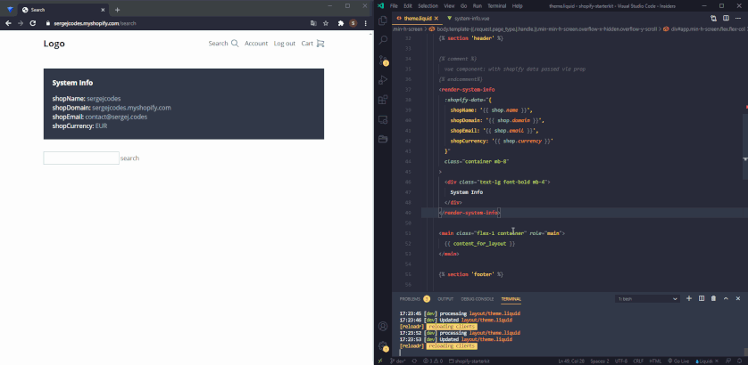

# Shopify Starterkit

Shopify Starterkit is a development environment for rapid Shopify theme development with Vue and Tailwind CSS 🔥
The kit provides an easy way to build a custom Shopify theme from scratch. It contains a minimal styled boilerplate as a starting point. Everything is pre-configured and should work out of the box.

## Features
- Shopify
- Shopify Theme Kit
- Vue
- Vuex
- Axios
- SCSS
- Tailwind CSS
- Webpack
- ESLint
- Auto-Reload
- Easily extendable

## System requirements
- Node.js
- npm or yarn

## Getting started
1. Get Shopify api access [Theme Kit Docs](https://shopify.github.io/themekit#get-api-access)
2. Clone or download this repo

3. Install dependencies:
```
$ yarn install
```

4. Initialize theme on Shopify with credentials from first step. Either for **dev** or **live** environment:
```
$ yarn shopify:init --password [your-api-password] --store [your-store.myshopify.com] --env [dev or live] --name [theme name]
```

5. Start developing:
```
$ yarn start
$ yarn open:dev
```

## Deploying
```
$ yarn build
$ yarn deploy:live
```

## Directories
| Directory | Description |
| - | - |
| .config | contains multiple configurations for the development environment |
| shopify | contains Shopify theme templates and config files |
| src | contains `tailwind`, `vue` and `scss` files |

## Tasks
| Task | Description |
| - | - |
| start | run `dev`, `reloadr` and `shopify:watch` tasks in parallel |
| dev | bundle and watch for changes in `src/` files with webpack |
| build | create dist files for Shopify in `shopify/assets/` directory with webpack |
| reloadr | run a http server and websocket server for remote auto reloading |
| lint | lint `js` and `vue` files inside the `src/` directory |
| shopify:watch | watch for changes in the `shopify/` directory and upload to the dev store |
| shopify:init | initialize theme on remote shopware store and create a shopify config file for specified environment |
| deploy:dev | upload the `shopify/` directory to the dev store |
| deploy:live | upload the `shopify/` directory to the live store |
| settings:dev | download `settings_data.json` from dev store |
| settings:live | download `settings_data.json` from live store |
| open:dev | open the url of the dev store |
| open:live | open the url of the live store |

## Development environment concepts
- By running `shopify:init` and entering credentials, the task initializes a new theme from `shopify/` directory on the provided Shopify store. It also saves a configuration file for the specified environment inside `.config/shopify/` directory. This file will be ignored by git and shouldn't be tracked for security reasons. All tasks regarding Shopify will use the credentials from the saved configuration file.
- By running `yarn start` 3 tasks are executed in parallel: `dev`, `reloadr` and `shopify:watch`.
- Inside the `src/` directory are: a tailwind config, scss files and vue related files.
- All vue related files are auto-loaded by webpack with [require.context](https://webpack.js.org/guides/dependency-management/#requirecontext) - vue components, vuex modules, mixins with `global` in their filename and directives with `global` in their filename.
- Vue components can be either used as regular single-file-components or as [renderless components](https://css-tricks.com/building-renderless-vue-components) without `<template></template>` tags.
- The webpack bundle and all other assets are outputted to `shopify/assets` directory.
- The `shopify/` directory is being watched for changes and all changed files are uploaded to the Shopify remote server. After the upload is finished, a request is sent to a localhost:port address and the [reloadr script](.config/reloadr/) reloads the remote store (if it's open in the browser).



## Limitations
- Already running Shopify tasks only upload files which are changed, a simple re-save of a file, without editing it, won't upload the file to the remote store
- Vue components inside `.liquid` files can only be used in a non-self-closing `<kebab-case></kebap-case>` manner
- `<style></style>` will be removed on mount inside vue components (basically everything inside #app), use `<component is="style"><componet>` instead when working with `.liquid` files